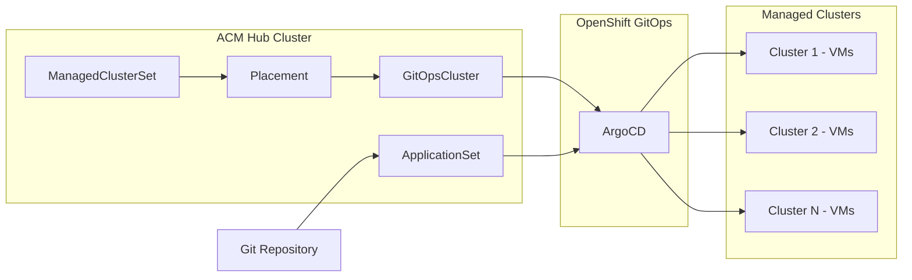

## Why fleet-scale VM deployment matters

I manage virtual machines across multiple OpenShift clusters. Every time a new cluster joins the fleet, I used to manually configure deployment targets, create secrets, and wire up pipelines. It was error-prone, slow, and impossible to audit.

Red Hat Advanced Cluster Management for Kubernetes (RHACM) with OpenShift GitOps eliminates this problem. A single ApplicationSet definition deploys VMs to every cluster that matches a label -- automatically. When I add a new cluster to the fleet, it receives the workload without any manual intervention.

In this post, I walk through deploying both Linux and Windows VMs at fleet scale using GitOps, with full visibility through RHACM's topology views.

## Prerequisites

Before you begin, ensure you have:

- Red Hat OpenShift Container Platform 4.22 or later with OpenShift Virtualization installed
- Red Hat Advanced Cluster Management 2.16 or later managing at least one cluster
- OpenShift GitOps (ArgoCD) 1.21 or later installed on the hub cluster
- A Git repository containing your VM manifests

## Architecture overview

## Step 1: Integrate RHACM with ArgoCD

RHACM and ArgoCD need to share cluster inventory. This integration enables ArgoCD to discover managed clusters through RHACM Placement resources.

Create a ManagedClusterSet that groups your virtualization-capable clusters, then bind it to the openshift-gitops namespace:

- **ManagedClusterSet** groups clusters visible to ArgoCD
- **ManagedClusterSetBinding** grants the gitops namespace access to the cluster set
- **Placement** selects clusters using label-based predicates (for example, virtualization-enabled=true)
- **GitOpsCluster** registers selected clusters as ArgoCD deployment targets

The application-manager addon provides the credentials ArgoCD needs to reach each managed cluster. Once installed, ArgoCD discovers managed clusters without manual secret management.

**Why this matters:** Label a new cluster and it automatically becomes a deployment target. Remove the label and it drops out. No manual ArgoCD configuration required.

## Step 2: Deploy Linux VMs via ArgoCD ApplicationSet

With integration complete, deploy VMs fleet-wide using an ApplicationSet with the clusterDecisionResource generator. This generator dynamically resolves which managed clusters to target based on RHACM Placement decisions.

The ApplicationSet references a Git repository path containing your VirtualMachine manifest. ArgoCD syncs this manifest to every cluster selected by the Placement. The sync policy includes automated pruning and self-healing -- if someone deletes a resource on a managed cluster, ArgoCD recreates it.

**Key design decisions:**

- The clusterDecisionResource generator queries RHACM PlacementDecisions directly
- requeueAfterSeconds ensures new cluster additions are picked up within minutes
- CreateNamespace=true handles namespace provisioning on target clusters automatically

Every deployed VM appears in the ArgoCD dashboard with real-time health status. From the RHACM console, the Application Topology view renders an interactive dependency graph spanning hub and managed clusters.

## Step 3: Deploy Windows VMs via Tekton pipelines

Windows VMs require a different workflow. Instead of deploying a pre-built container disk, I build golden images using OpenShift Pipelines (Tekton).

The pipeline orchestrates four stages:

1. **Import the Windows ISO** via a CDI DataVolume from an in-cluster HTTP file server
2. **Provision a blank install disk** as a second DataVolume
3. **Apply the autounattend ConfigMap** that automates the entire Windows installation -- VirtIO driver loading, disk partitioning, RDP enablement, and QEMU Guest Agent installation
4. **Create the VirtualMachine** resource referencing both disks

The pipeline runs to completion without interactive prompts. The result is a running Windows Server 2019 VM with all drivers installed and remote access configured.

**Business value:** Every golden image build is a versioned pipeline run with a full audit trail. Teams can trigger builds on demand or on a schedule, and the pipeline definition lives in Git alongside the VM manifests.

## Step 4: Verify deployments with topology views

After deployment, RHACM provides two levels of visibility:

**Application Topology** interprets ArgoCD Application objects to render an interactive graph showing all components across hub and managed clusters. I can click any VirtualMachine node to view resource details, current phase (Running, Stopped, Migrating), and events timeline.

**Fleet Virtualization** (new in RHACM 2.16) provides a dedicated console for VM lifecycle management. From a single page, I can see every VM across the fleet, perform start/stop/restart operations, and jump to the VM console -- all without direct access to the managed cluster.

The search-collector agent on each managed cluster streams VirtualMachine metadata to the hub's search index. Lifecycle actions are proxied through cluster-proxy to the managed cluster's KubeVirt API. I never need a kubeconfig for the managed cluster.

## Tips and best practices

- **Use labels consistently.** The entire workflow hinges on cluster labels. Establish a labeling taxonomy early (for example, virtualization-enabled, environment, region).
- **Store VM manifests in Git.** Every change is a commit with author, timestamp, and diff. This is your audit trail.
- **Use container disks for Linux VMs** where possible. They boot faster than ISO-based installations and work seamlessly with GitOps.
- **Reserve Tekton pipelines for Windows** or other VMs that require interactive installation automation.
- **Monitor ApplicationSet sync status.** The requeueAfterSeconds setting determines how quickly new clusters receive workloads.

## Common issues and troubleshooting

- **ApplicationSet shows no applications:** Wait 1-2 minutes for the clusterDecisionResource generator to pick up PlacementDecisions. Verify the Placement has at least one matching cluster.
- **ArgoCD cannot reach managed cluster:** Confirm the application-manager addon is installed and the cluster secret exists in the openshift-gitops namespace.
- **Windows pipeline stalls:** Verify the ISO is uploaded to the file server and the DataVolume URL matches the file server's internal service address.

## What you accomplished

You deployed Linux and Windows VMs across a fleet of OpenShift clusters using two complementary models: ArgoCD ApplicationSets for declarative fleet-wide deployment, and Tekton pipelines for reproducible Windows golden image builds. Both approaches provide full audit trails and eliminate manual per-cluster configuration.

## Call to action

Explore the [OpenShift Virtualization documentation](https://docs.openshift.com/container-platform/latest/virt/about_virt/about-virt.html) to learn more about running VMs on OpenShift. Review the [RHACM documentation](https://access.redhat.com/documentation/en-us/red_hat_advanced_cluster_management_for_kubernetes/) for advanced Placement and ApplicationSet patterns. Try the [demo repository](https://github.com/tosin2013/acm-virt-management-demo) to see these workflows in action.
