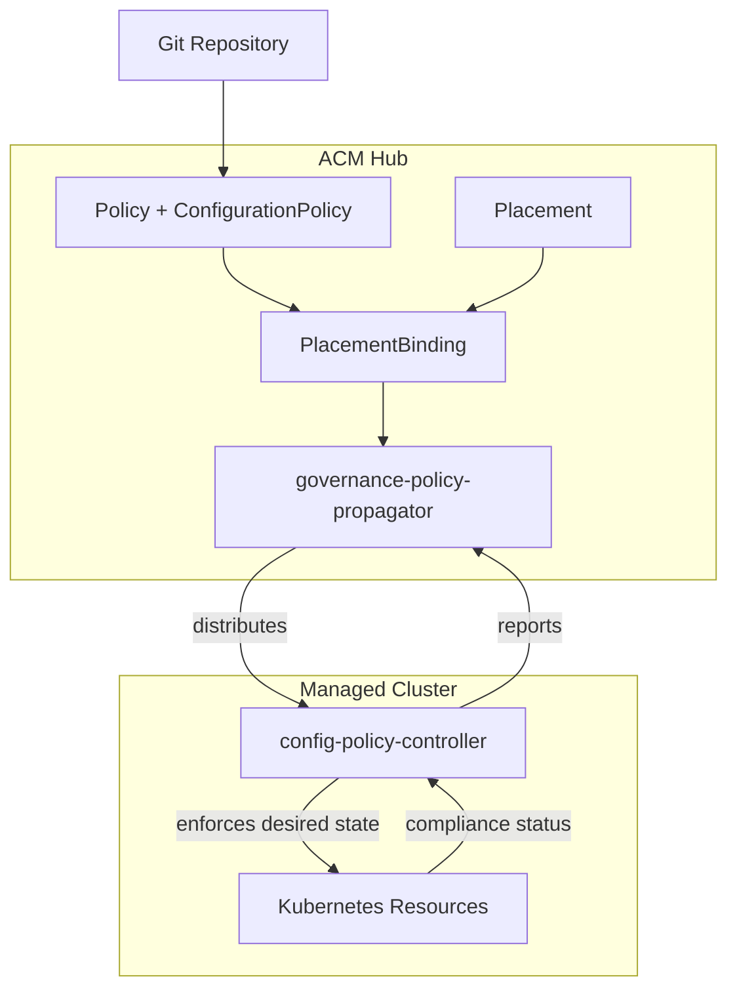

## The drift problem at scale

I run virtual machines across 15 OpenShift clusters. Each cluster team used to manage VM policies independently -- backup schedules, network rules, resource limits. The result was predictable: configuration drift, missed backups, inconsistent security postures, and compliance gaps that only surfaced during audits.

Red Hat Advanced Cluster Management for Kubernetes (RHACM) solves this with ConfigurationPolicy resources that wrap KubeVirt objects in a declarative governance layer. The policy engine continuously monitors managed clusters and automatically remediates drift. If a required configuration is deleted or modified, RHACM recreates it within seconds.

In this post, I walk through the architecture of five governance policies that treat VM infrastructure as code, each mapped to recognized compliance controls.

## Background: how RHACM policies work

RHACM policies follow a three-layer model:

1. **Policy** -- defines what must exist (or must not exist) on managed clusters
2. **Placement** -- selects which clusters receive the policy based on labels
3. **PlacementBinding** -- connects the policy to the placement

Each policy contains one or more ConfigurationPolicy templates that describe the desired state of Kubernetes resources. The governance controller on each managed cluster compares actual state against desired state and reports compliance. When remediationAction is set to enforce, deviations are corrected automatically.

Policies target only relevant clusters. In my fleet, I label virtualization-capable clusters with virtualization-enabled=true. The Placement selects these clusters exclusively, so governance overhead is zero for clusters that don't run VMs.

## Core components: five governance policies

### VM right-sizing metrics

**NIST control:** CM-2 (Baseline Configuration)

This policy deploys two resources to every virtualization-enabled cluster:

**PrometheusRule** -- recording rules that calculate kubevirt:vm_cpu_usage_ratio and kubevirt:vm_memory_usage_ratio for every running VM. These ratios surface over-provisioned VMs (wasting capacity) and under-provisioned VMs (risking out-of-memory kills).

**Custom metrics allowlist** -- ensures these VM-specific metrics are forwarded to the RHACM hub's observability stack (Thanos). Without the allowlist, the metrics stay local to each cluster and fleet-wide dashboards show nothing.

The policy uses remediationAction: enforce. If someone deletes the PrometheusRule, RHACM recreates it. The recording rules feed directly into the Grafana dashboards demonstrated in fleet observability workflows.

### Backup enforcement

**NIST controls:** CP-9 (System Backup), CP-10 (System Recovery)

Business continuity for VM workloads requires automated, verified backups. This policy enforces three layers:

1. **OADP Operator subscription** -- ensures OpenShift API for Data Protection (OADP) is installed on every virtualization cluster
2. **Daily backup schedule** -- a Velero Schedule resource targeting vm-production and vm-staging namespaces at 2:00 AM daily, with CSI volume snapshots
3. **DataProtectionApplication** -- configures Velero with the kubevirt plugin for VM-aware backups that respect virtual machine memory state

The operator subscription and backup schedule use remediationAction: enforce. The DataProtectionApplication uses remediationAction: inform because it requires S3 credentials that must be provisioned separately per cluster.

**Self-healing in action:** Delete the backup schedule on any managed cluster. Within 2-3 minutes, RHACM detects the drift and recreates it. This eliminates the risk of missed backups due to human error or malicious deletion.

### Network isolation

**NIST control:** SC-7 (Boundary Protection)

In a shared cluster, unrestricted network access between VM namespaces creates lateral movement risk. A compromised VM in vm-staging could reach production services in vm-production.

This policy enforces a default-deny NetworkPolicy in VM namespaces, allowing only:

- Same-namespace pod-to-pod traffic
- Monitoring scrape from openshift-monitoring
- DNS resolution via openshift-dns
- Outbound HTTP/HTTPS for package updates

All other traffic is denied by default. The policy applies to both vm-production and vm-staging namespaces across every virtualization-enabled cluster.

### Resource guardrails

**NIST control:** CM-7 (Least Functionality)

A VM created with extreme resource requests (for example, 64 GiB memory on a 32 GiB node) can starve other workloads. This policy enforces a LimitRange in VM namespaces:

- **Minimum CPU:** 500m (prevents trivially small VMs that waste scheduling overhead)
- **Maximum CPU:** 8 cores (prevents monopolizing a node)
- **Minimum memory:** 512 MiB (ensures VMs have enough to boot)
- **Maximum memory:** 16 GiB (prevents single-VM node starvation)
- **Default requests:** 1 CPU, 1 GiB memory (applied when no request is specified)

These guardrails prevent noisy-neighbor problems without restricting legitimate workloads. The limits are configurable per environment -- production clusters might allow higher maximums than development clusters.

### Eviction strategy and security hardening

**NIST controls:** CP-2 (Contingency Plan), SC-28 (Protection of Information at Rest), CM-6 (Configuration Settings)

Two policies work together here:

**VM eviction strategy** uses remediationAction: inform to detect VMs that lack the LiveMigrate eviction strategy. Non-migratable VMs block OpenShift upgrades and node maintenance indefinitely. The inform-only approach flags the issue without forcefully restarting production VMs.

**Security hardening** creates a VirtualMachineClusterPreference named hardened-server-vm that disables serial console and graphics device attachment. Production server VMs rarely need these interfaces, and leaving them enabled expands the QEMU attack surface. New VMs reference the hardened preference to inherit the security settings automatically.

## Workflows and processes: the policy lifecycle

### Deployment flow

1. I commit policy YAML to Git
2. A CI pipeline or manual apply pushes the policy to the RHACM hub
3. The hub's governance-policy-propagator distributes the policy to managed clusters matching the Placement
4. Each managed cluster's config-policy-controller evaluates the templates
5. Compliance status rolls up to the hub console within seconds

### Drift remediation flow

1. An operator (or attacker) deletes a resource on a managed cluster
2. The config-policy-controller detects the deviation within 10-30 seconds
3. For enforce policies, the controller recreates the resource immediately
4. For inform policies, the hub console shows NonCompliant status
5. Audit events are recorded with timestamp, cluster, and resource details

### Compliance reporting

The RHACM Governance Overview dashboard shows policy violations mapped to compliance categories. I can filter by NIST SP 800-53 control families to demonstrate coverage during audits. Each policy carries annotations linking it to specific controls.

## Best practices

- **Start with inform, then move to enforce.** Deploy new policies in inform mode first to understand the blast radius. Switch to enforce once you confirm the policy does not disrupt running workloads.
- **Use Git as the source of truth.** Store all policy YAML in a Git repository. Changes go through pull request review. ArgoCD or RHACM Subscriptions sync policies from Git.
- **Layer policies by concern.** Separate backup policies from network policies from resource policies. This enables independent lifecycle management and team ownership.
- **Test policies in non-production first.** Use Placement label selectors to target staging clusters before production.
- **Map policies to compliance controls.** Annotate each policy with the NIST, DISA STIG, or PCI-DSS control it satisfies. This simplifies audit evidence collection.

## Common challenges and solutions

| Challenge | Solution |
|-----------|----------|
| Policy shows NonCompliant but resources exist | Check for spec mismatches -- the controller compares full object specs, not just existence |
| Backup schedule policy stays NonCompliant | The OADP Operator needs 2-3 minutes to install CRDs. Wait for the operator CSV to reach Succeeded |
| NetworkPolicy blocks legitimate traffic | Add explicit ingress/egress rules for the required traffic patterns before enforcing |
| LimitRange rejects VM creation | Adjust the min/max bounds to accommodate your largest legitimate VM workload |
| Inform policies show blank compliance | This is expected when no violations exist -- the policy reports only when it detects a mismatch |

## Use cases and real-world applications

**Regulatory audit preparation:** Map the five policies to NIST SP 800-53 controls (CM-2, CP-9, CP-10, SC-7, CM-7, CP-2, SC-28, CM-6). Export compliance status from RHACM as evidence. Demonstrate continuous enforcement rather than point-in-time snapshots.

**VMware migration governance:** Organizations migrating from VMware need equivalent governance on day one. These policies provide backup, network isolation, and resource controls from the moment the first VM boots on OpenShift.

**Multi-tenant VM hosting:** Service providers running VM workloads for multiple tenants use these policies to enforce isolation boundaries and prevent resource abuse without per-tenant manual configuration.

## What comes next

These policies form the foundation of a VM governance framework. They integrate directly with fleet observability (centralized Grafana dashboards powered by the right-sizing metrics policy) and right-sizing recommendations (data-driven VM resizing based on the recording rules deployed here).

## Call to action

Explore the [ACM Policy Collection](https://github.com/open-cluster-management-io/policy-collection) for additional policy templates covering certificate management, Gatekeeper constraints, and image vulnerability scanning. Read the [RHACM governance documentation](https://access.redhat.com/documentation/en-us/red_hat_advanced_cluster_management_for_kubernetes/) for advanced policy templating and hub-side aggregation. Review the [NIST SP 800-53 control catalog](https://csf.tools/reference/nist-sp-800-53/) to identify additional controls your policies should address.
