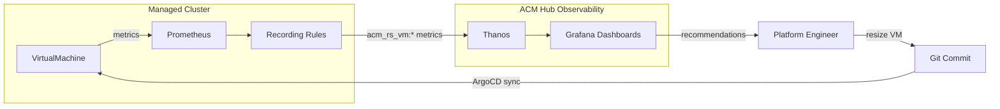

## The capacity planning gap after VMware

Organizations migrating from VMware consistently hit the same wall: they lose Distributed Resource Scheduler (DRS). For years, DRS automatically balanced VM resource allocation across clusters. Without it, teams fall back to guesswork -- allocating 4 GiB of memory to workloads that use 400 MiB, and 4 vCPUs to single-threaded services. This waste compounds across hundreds of VMs and dozens of clusters.

Red Hat Advanced Cluster Management for Kubernetes (RHACM) 2.16 closes this gap with built-in VM right-sizing. It activates automatically when you enable observability -- no manual policy deployment, no additional operators, no licenses. Instead of a proprietary black-box algorithm, you get transparent Prometheus-based metrics that integrate with your existing monitoring and alerting workflows.

## What is VM right-sizing in RHACM 2.16?

VM right-sizing is a built-in observability feature that continuously tracks CPU and memory utilization for every virtual machine across your managed fleet. It compares actual usage against requested resources and surfaces two categories of waste:

**Over-provisioned VMs** request far more resources than they consume. A Fedora VM running a lightweight httpd service might request 4 GiB of memory while using only 400 MiB. That 3.6 GiB difference is capacity locked away from other workloads.

**Under-provisioned VMs** consume more resources than they request. These are the VMs at risk of out-of-memory kills or CPU throttling -- the silent performance problems that surface as user complaints rather than monitoring alerts.

RHACM surfaces both categories through pre-built Grafana dashboards at three levels of granularity: fleet-wide, per-namespace, and per-VM detail.

## How it works

### Automatic deployment

When RHACM Observability is enabled (Grafana + Thanos backed by S3 object storage), the system automatically deploys:

- **Recording rules policies** (rs-prom-rules-policy and rs-virt-prom-rules-policy) distributed via the open-cluster-management-global-set namespace to all managed clusters
- **Pre-built Grafana dashboards** in the RightSizing Recommendation and ACM / OpenShift Virtualization folders
- **Metrics allowlists** that forward acm_rs_vm recording rule results from managed clusters to the hub's Thanos

No manual configuration is required. Every managed cluster with observability enabled gets right-sizing data collection immediately.

### The metrics pipeline

On each managed cluster, Prometheus recording rules calculate four metrics per VM every 5 minutes:

- **acm_rs_vm:namespace:cpu_request:5m** -- vCPU count allocated
- **acm_rs_vm:namespace:cpu_usage:5m** -- actual CPU consumed
- **acm_rs_vm:namespace:memory_request:5m** -- memory allocated
- **acm_rs_vm:namespace:memory_usage:5m** -- actual memory consumed

These metrics flow through the observability pipeline to the hub's Thanos, where daily aggregation produces recommendations with a configurable headroom margin (default: 110%, meaning 10% above observed peak usage).

### Dashboard hierarchy

The dashboards provide a three-level drill-down:

**Fleet overview** shows total overestimation and underestimation counts across all managed clusters. This is the executive view -- "how much waste exists fleet-wide?"

**Namespace view** aggregates resource waste by namespace with configurable time windows (15-day or 30-day). This helps identify which teams or applications are the largest offenders.

**Per-VM detail** shows time-series CPU and memory usage versus requests for individual VMs. The overestimation view flags VMs wasting resources. The underestimation view flags VMs at risk of resource exhaustion.

## Benefits over VMware DRS

| Capability | VMware DRS | RHACM 2.16 right-sizing |
|-----------|-----------|------------------------|
| Algorithm transparency | Proprietary black box | Open Prometheus recording rules |
| Multi-cluster scope | Per-vSphere cluster only | Fleet-wide across all managed clusters |
| Integration | VMware ecosystem only | Any Prometheus/Grafana toolchain |
| Licensing | vSphere Enterprise Plus | Included with RHACM |
| Customization | Limited tuning knobs | Full control over recording rules and thresholds |
| Automation | Automatic vMotion | Recommendations with manual or GitOps-driven resize |

The fundamental difference is transparency. With DRS, you trust the algorithm. With RHACM right-sizing, you can inspect every recording rule, query the raw metrics, and verify recommendations against your own understanding of workload behavior.

## Challenges and considerations

**Right-sizing is advisory, not automatic.** Unlike DRS, RHACM does not automatically resize VMs. It provides recommendations that operators act on -- either manually or by committing updated resource requests to Git and letting ArgoCD sync the change. This is a deliberate design choice: automatic resizing can disrupt stateful workloads.

**Aggregation windows require patience.** Daily aggregation means recommendations stabilize after 24-48 hours of observation. Freshly deployed VMs show incomplete data until enough usage history accumulates.

**Windows VMs work identically.** The recording rules analyze the KubeVirt metrics layer, not the guest OS. Both Linux and Windows VMs produce the same acm_rs_vm metrics without requiring in-guest monitoring agents.

**Thresholds are configurable.** The default 110% recommendation margin suits most workloads. Organizations with stricter SLAs can increase it (for example, 125% for production databases). Cost-aggressive teams can decrease it. The rs-virt-config ConfigMap in the open-cluster-management-observability namespace controls this behavior.

## The complete feedback loop

Right-sizing works best as a continuous cycle:

1. **Observe** -- identify over-provisioned VMs in the Grafana dashboards
2. **Decide** -- compare the recommendation against workload requirements and SLAs
3. **Resize** -- update the VM resource requests (via Git commit for GitOps workflows)
4. **Verify** -- confirm the workload remains healthy after the resize
5. **Repeat** -- monitor the updated VM for the next aggregation cycle

In production, this loop integrates with change management processes. The Grafana dashboard provides the evidence. The Git commit provides the audit trail. The ArgoCD sync provides the deployment mechanism.

## Future trends

RHACM right-sizing represents the first generation of Kubernetes-native capacity intelligence. Future directions include:

- **Predictive scaling** based on historical usage patterns and seasonal trends
- **Automated resize with guardrails** -- resizing VMs within administrator-defined bounds without manual intervention
- **Cost attribution** -- mapping resource waste to team budgets and chargeback models
- **Integration with vertical pod autoscaling** for container workloads alongside VMs

## Call to action

Enable [RHACM Observability](https://access.redhat.com/documentation/en-us/red_hat_advanced_cluster_management_for_kubernetes/) on your hub cluster to activate right-sizing immediately. Explore the pre-built dashboards in the RightSizing Recommendation folder in Grafana. Review the [OpenShift Virtualization documentation](https://docs.openshift.com/container-platform/latest/virt/about_virt/about-virt.html) for VM resource configuration best practices. Visit the [right-sizing integration repository](https://github.com/stolostron/right-sizing) for recording rule details and customization options.
