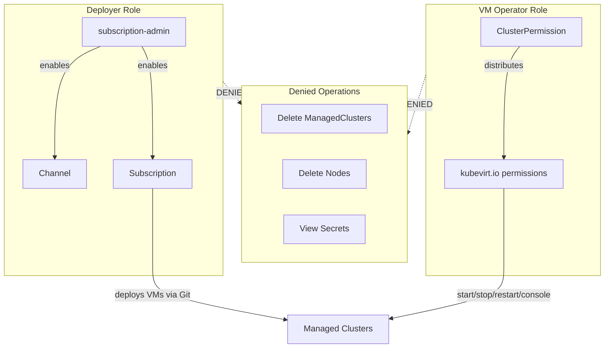

## The cluster-admin trap

I have seen it in every organization I work with: development teams need to deploy VM workloads across multiple clusters, so someone grants cluster-admin to "just get it working." Within months, 30 people have cluster-admin credentials. A single leaked credential can delete namespaces, drain nodes, or destroy the entire platform.

This is not a theoretical risk. Regulatory frameworks like NIST, PCI-DSS, and HIPAA require least-privilege access models. Cluster-admin for deployment is a compliance violation waiting to be flagged.

Red Hat Advanced Cluster Management for Kubernetes (RHACM) provides two mechanisms that eliminate this trap: subscription-admin for cross-namespace deployment and the ClusterPermission API for scoped operational access. Together, they prove that productivity and security are complementary, not competing concerns.

## Prerequisites

Before you begin, ensure you have:

- Red Hat Advanced Cluster Management 2.16 or later
- OpenShift Container Platform 4.22 or later with OpenShift Virtualization
- A hub cluster managing at least one cluster with the virtualization-enabled=true label
- A Git repository containing VM manifests
- The cluster-permission add-on installed (included with RHACM 2.16)

## Permission model overview

## Step 1: Bind the subscription-admin role

RHACM provides the open-cluster-management:subscription-admin ClusterRole. This role allows users to create Git Subscriptions that deploy resources across multiple namespaces on managed clusters -- without cluster-admin.

Create a ClusterRoleBinding that grants subscription-admin to your deployment service account or user group. The binding enables cross-namespace Git deployments while explicitly excluding destructive cluster lifecycle operations.

After binding, verify the deployer user:

- **Can** create Subscriptions, Channels, and Placements
- **Cannot** delete managed clusters
- **Cannot** delete managed cluster sets
- **Cannot** delete nodes

This verification is the proof point. The user has deployment reach without destruction capability.

## Step 2: Deploy a VM via Git Subscription

With subscription-admin bound, create a deployment pipeline using three RHACM resources:

**Channel** -- points to your Git repository containing VM manifests.

**Placement** -- selects which managed clusters receive the deployment based on labels. Use the same virtualization-enabled=true predicate from your cluster labeling taxonomy.

**Subscription** -- references the Channel and specifies the Git path containing your VirtualMachine, Service, and Namespace manifests. The annotation apps.open-cluster-management.io/git-path targets a specific directory in the repository.

Once created, RHACM detects the Git content, evaluates the Placement, and distributes the manifests to matching clusters. The Subscription status transitions to Propagated within 30-60 seconds.

**What happens on the managed cluster:** RHACM creates the target namespace, applies the VirtualMachine resource, and deploys associated Services. The VM boots using a container disk with cloud-init configuration. Within 90 seconds, a running VM is serving traffic -- deployed entirely through Git by a user who never had cluster-admin.

## Step 3: Configure fine-grained VM operator access

Deploying VMs is one workflow. Operating them is another. VM operators need to start, stop, restart, and access VM consoles -- but they should not see nodes, secrets, or cluster-level configuration.

The ClusterPermission API (clusterpermissions.rbac.open-cluster-management.io) distributes surgical permissions from the hub to managed clusters:

1. **Define a custom ClusterRole** with exact kubevirt.io permissions: get, list, watch, update, patch for VirtualMachine and VirtualMachineInstance resources, plus start, stop, restart, and console subresources
2. **Create a ClusterRoleBinding** targeting a group (for example, vm-operators) rather than individual users
3. **Apply the ClusterPermission** in the namespace matching the managed cluster name on the hub

RHACM generates ManifestWork to distribute the Role and RoleBinding to the target cluster. The permissions are continuously synchronized -- if someone deletes the RoleBinding on the managed cluster, RHACM recreates it.

**Group-based design:** Bind to a group, not individual users. Team membership changes propagate automatically without updating manifests. Add a new operator to the vm-operators group and they immediately receive scoped access across all managed clusters.

## Step 4: Verify the access boundaries

The most compelling demonstration is proving what the scoped user cannot do:

**VM operator verification:**

- Can view VMs across assigned clusters from the Fleet Virtualization console
- Can start, stop, restart, and access VM consoles
- Cannot see nodes, secrets, or cluster-level configuration
- Cannot create or delete managed clusters
- Cannot view governance policies or infrastructure details

**Deployer verification:**

- Can deploy VMs to managed clusters via Git Subscription
- Can create Subscriptions and Channels
- Cannot delete managed clusters or cluster sets
- Cannot perform destructive node operations

Open the RHACM console in two browser windows -- one as the admin, one as the vm-operator. The contrast is immediate: the admin sees the full RHACM feature set; the vm-operator sees only Fleet Virtualization for their assigned clusters.

## Tips and best practices

- **Separate deployer and operator roles.** Deployers push to Git. Operators manage running VMs. These are different personas with different permission requirements.
- **Use groups, not individual users.** ClusterPermission subjects should reference Groups for scalable team management.
- **Audit with Git.** Every deployment change is a Git commit with author, timestamp, and diff. This satisfies audit trail requirements without additional tooling.
- **Start narrow, expand later.** Begin with a single managed cluster set. Add clusters to the set as you validate the permissions model.
- **Revoke centrally.** Deleting a ClusterPermission on the hub removes the distributed RBAC from all managed clusters within seconds.

## Common issues and troubleshooting

- **Subscription stays in Pending state:** Verify the ManagedClusterSetBinding exists in the subscription namespace and the Placement has at least one matching cluster.
- **VM operator cannot see VMs in console:** Confirm the user is in the vm-operators group and the ClusterPermission ManifestWork shows Applied status on the managed cluster.
- **Deployer gets Forbidden on subscription creation:** Verify the subscription-admin ClusterRoleBinding references the correct user or group name.
- **ClusterPermission drift detection:** Check ManifestWork status on the hub. If it shows Degraded, the managed cluster agent may need restarting.

## What you accomplished

You deployed a running VM to a managed cluster entirely through Git, using a user without cluster-admin privileges. You then configured a separate VM operator role with surgical kubevirt.io permissions -- start, stop, restart, and console access without visibility into nodes, secrets, or cluster infrastructure. Both roles are centrally managed from the hub and continuously synchronized.

## Call to action

Review the [ClusterPermission add-on documentation](https://github.com/open-cluster-management-io/cluster-permission) for advanced permission patterns including namespace-scoped roles and time-bound access. Explore [RHACM subscription documentation](https://access.redhat.com/documentation/en-us/red_hat_advanced_cluster_management_for_kubernetes/) for Git-based deployment workflows. Try the RBAC configurations from the [demo repository](https://github.com/tosin2013/acm-virt-management-demo) to validate the access model in your environment.
