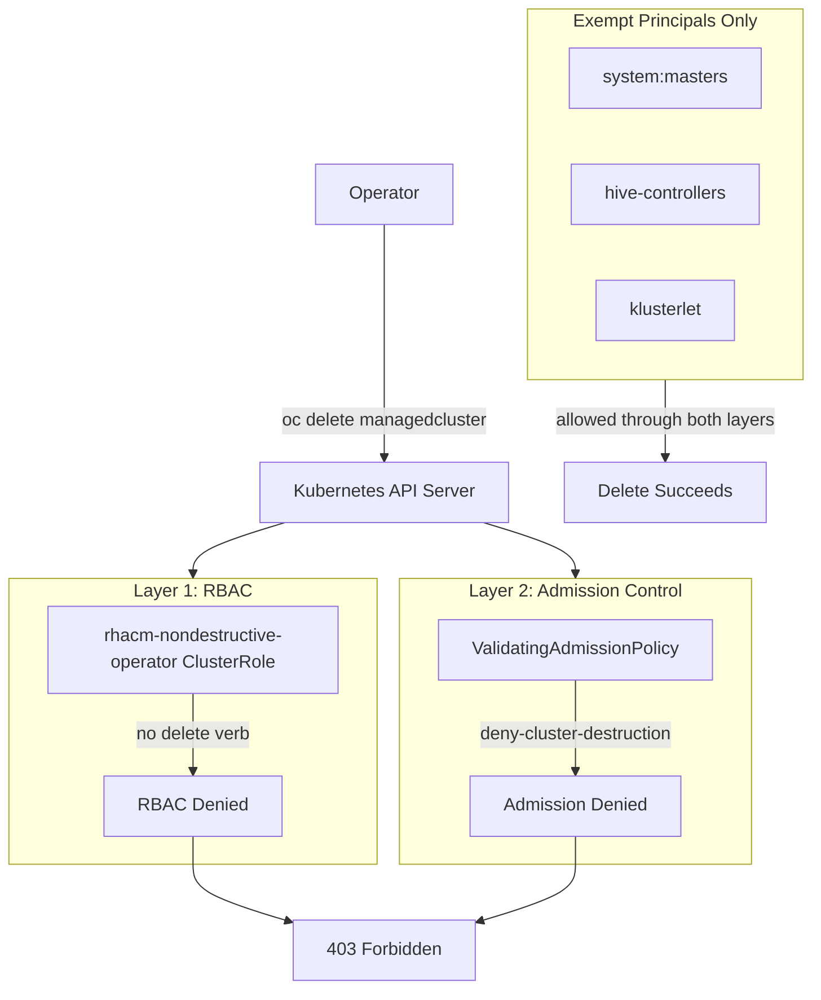

## The most dangerous verb in your fleet

A single command can take down production workloads across an entire region: oc delete managedcluster. A compromised credential, a fat-fingered CLI session, or a rogue insider with the delete verb on managedclusters can destroy infrastructure in seconds.

The default open-cluster-management:cluster-manager-admin role grants create, read, update, and delete on all cluster lifecycle resources. This is the equivalent of giving every building manager a demolition permit -- technically correct for their responsibilities, but operationally catastrophic when exercised by mistake.

I believe cluster destruction should not be something we discourage through policies, training, or change management processes. It should be architecturally impossible for non-emergency users. Here is how we achieve that.

## Where things currently stand

Most organizations rely on a single layer of defense: Kubernetes RBAC. They create custom ClusterRoles that omit the delete verb for cluster lifecycle resources and bind those roles to operational users.

This approach has a fundamental flaw. Kubernetes RBAC is additive. Permissions from all bound ClusterRoles are unioned together. If an operator inherits delete from any other binding -- a ManagedClusterSet admin role, a namespace-scoped wildcard, or a misconfigured automation service account -- the protection disappears. RBAC cannot remove permissions; it can only add them.

Organizations discover this gap during penetration tests or compliance audits. By then, the exposure has existed for months.

## The defense-in-depth approach

Solving this requires two independent mechanisms that must both allow an operation before it succeeds.

### Layer 1: Non-destructive ClusterRole

A custom rhacm-nondestructive-operator ClusterRole explicitly omits the delete verb for all cluster lifecycle API groups:

- managedclusters (cluster.open-cluster-management.io)
- clusterdeployments (hive.openshift.io)
- clusterclaims and clusterpools (hive.openshift.io)
- managedclustersets and managedclustersetbindings (cluster.open-cluster-management.io)

Operators bound to this role retain full observational and update capabilities -- get, list, watch, update, patch. They can label clusters, update configurations, manage policies, and deploy applications. Only destruction is removed.

This layer handles the common case: properly configured users cannot delete clusters through their primary role binding.

### Layer 2: ValidatingAdmissionPolicy

A Kubernetes-native ValidatingAdmissionPolicy named deny-cluster-destruction acts as the second gate. This is not an RBAC mechanism -- it operates at the admission control layer of the Kubernetes API server.

When any user sends a DELETE request for a cluster lifecycle resource, the admission controller evaluates the policy before the request reaches the resource. If the user is not in the exempt list (system:masters, cluster-admins, or RHACM system service accounts), the request is denied with an explicit error message.

This layer closes the RBAC additivity gap. Even if a user inherits delete from any ClusterRoleBinding, the admission policy blocks the API call. The protection is independent of how many roles are bound to the user.

## Why two layers matter

Consider the failure modes each layer prevents:

**Layer 1 alone fails when:** A ManagedClusterSet admin binding is accidentally applied to the operator group. The delete verb from the admin binding unions with the non-destructive role, and the operator can now destroy clusters.

**Layer 2 alone fails when:** The admission policy is deleted or misconfigured. Without the RBAC layer, the operator immediately regains full cluster lifecycle permissions.

**Both layers together:** The RBAC layer prevents deletion in the normal case. The admission policy prevents deletion in the misconfiguration case. An attacker must compromise both layers simultaneously -- a significantly harder problem.

## Opportunities for your organization

**Compliance acceleration.** DISA STIG, NIST SP 800-53, HIPAA, and PCI-DSS all require controls for destructive actions on critical infrastructure. A ValidatingAdmissionPolicy provides auditable, cryptographic proof that cluster deletion is denied at the API server level. This is stronger evidence than any RBAC configuration alone.

**Operational confidence.** Platform teams move faster when they know the blast radius of a mistake is bounded. Operators who cannot accidentally destroy clusters are more willing to experiment, automate, and delegate.

**Zero-trust posture.** Even a fully compromised hub account -- stolen credentials, session hijack, insider threat -- cannot destroy the managed fleet. The admission controller operates below the authentication layer, at the API server's admission control gate.

## Challenges to address

**Emergency access.** Legitimate cluster decommissioning still needs to be possible. The matchConditions in the admission policy exempt system:masters and a designated cluster-admins group. Emergency decommissioning requires elevation to one of these groups through a controlled break-glass procedure.

**Policy drift.** If the ValidatingAdmissionPolicy itself is deleted, the protection disappears. Protect the policy with a second-level admission controller, or use RHACM governance to enforce the policy's existence on the hub cluster with automatic drift remediation.

**Service account exemptions.** RHACM system service accounts (klusterlet, hive-controllers) need delete access for legitimate cluster lifecycle operations. The policy must explicitly exempt these principals while blocking all human users.

## Actionable insights

1. **Deploy the non-destructive ClusterRole** as your baseline operational role for all cluster operators who are not cluster-admins.
2. **Apply the ValidatingAdmissionPolicy** on the hub cluster to close the RBAC additivity gap.
3. **Exempt only system:masters, a designated break-glass group, and RHACM system service accounts.** Every other principal is denied.
4. **Test with --dry-run=server.** Attempt oc delete managedcluster as your operational user. The API server should return a Forbidden error with the admission policy's denial message.
5. **Protect the policy itself.** Use RHACM governance or a second admission policy to prevent deletion of the deny-cluster-destruction policy.
6. **Document the break-glass procedure.** Define exactly how and when emergency cluster decommissioning is authorized, and audit every invocation.

## The broader principle

This approach embodies a design philosophy I see gaining momentum across platform engineering: security constraints as architectural properties, not operational procedures.

Procedures fail. People skip steps under pressure. Training is forgotten. But an admission policy that denies DELETE at the API server level cannot be circumvented by human error. It operates at the same layer as authentication itself.

The organizations that adopt this mindset -- where safety is a property of the system rather than a behavior of the operators -- are the ones that scale securely. They build platforms where 200 operators can work confidently because the system prevents catastrophic outcomes regardless of individual actions.

## Call to action

Implement [ValidatingAdmissionPolicies](https://kubernetes.io/docs/reference/access-authn-authz/validating-admission-policy/) in your environment to enforce destruction prevention at the API server level. Review the [RHACM documentation](https://access.redhat.com/documentation/en-us/red_hat_advanced_cluster_management_for_kubernetes/) for managed cluster lifecycle management and RBAC best practices. Explore the [demo repository](https://github.com/tosin2013/acm-virt-management-demo) for ready-to-apply ClusterRole and admission policy manifests that satisfy NIST SP 800-53 destructive action controls.
